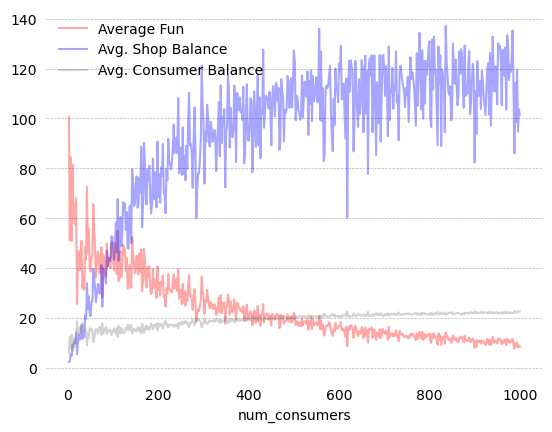

## Repositório da disciplina 

# Python: do básico à autonomia intermediária

### Oferecida pelo 

### Mestrado Profissional em Políticas Públicas e Desenvolvimento (MPPPD) do 

### Instituto de Pesquisa Econômica Aplicada, o Ipea.

Bernardo Alves Furtado

1o. semestre 2022

#### Alunos
1. Rodrigo Fracalosi
2. Jainne Coutinho
3. Kátia Vaz
4. Haroldo Metzker
5. Flávio Carneiro
6. Pedro H. Souza
7. Christiane de Araujo

8. Marcos Hecksher
9. Fabiano dos Anjos
11. Felippe Rocha
12. André Felipe
13. Marcos Alencar
14. Luiz Felipe Monteiro Seixas

